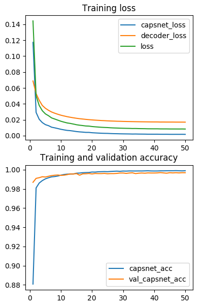
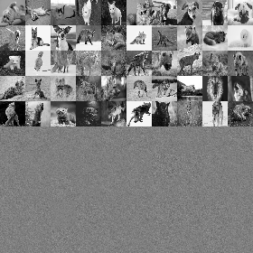
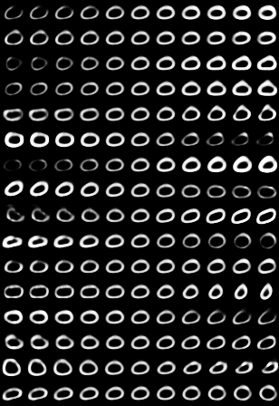
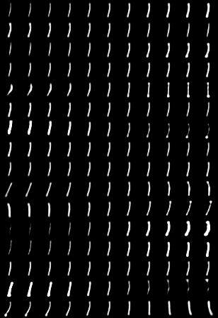
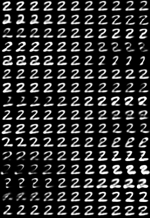
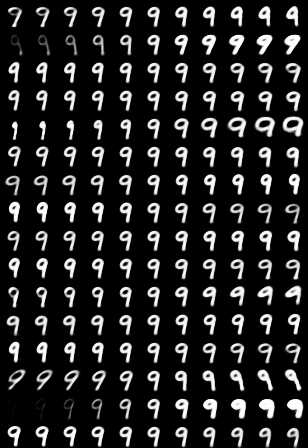

# CDAE4InfoExtraction [](https://github.com/grassknoted/CDAE4InfoExtraction/blob/master/LICENSE)
[WIP] Cross-domain Auto-encoders for Information Extraction, using Capsule Networks


## Load the data and preprocess it into a 28 by 28 form

Use Tensorflow or other packages to reshape the images and preprocess the training data.

## Build a distribution using IWAE or VAE incorporating Capsule networks

Build on the CapsNet framework given in the other program. In addition to that, extract two vectors from
each capsule Mu and Sigma to generate 'n' distributions and build 'n' capsules. Use Reparametrization trick
for multidimensional data to obtain the distributions. Once the capsules are setup, we use KL Divergence in
addition to MSE to train the model on the Adam optimizer.

## Sample from the distribution and decode to identify 'important' elements

Use Importance Sampling to get 'n' samples from the correctly identified distribution and decode that using
a deep setup and generate the output (multi-hot output of the vocabulary). In case we aren't using IWAE for the 
initial prototypes, just sample from the top 1-3 standard deviations of the distribution and decode it. The learning
methodologies are a combination of Backpropogation and Hinton's novel learning method for CapsNets. 

## Testing

For testing, just feed a test instance to the CapsNets and the vectors in the vocabulary will identify the 'important'
parts of the data. This solves the objective.

## Reasons for using specific elements in the setup
1. IWAE - With the tight lower bound on the VAE, IWAE provides some freedom to generate accurate distributions.
2. CapsNets - Like the IWAE, CapsNets are improvements to the standard CNN setup to obtrain better results.
3. VAE - To perform Transfer Learning betweek domains.
4. Dataset - Due to unavailability of data in the form we are looking for, we decided to synthesize our own data.

## CapsNet-Keras
A Keras implementation of CapsNet in the paper:   
[Sara Sabour, Nicholas Frosst, Geoffrey E Hinton. Dynamic Routing Between Capsules. NIPS 2017](https://arxiv.org/abs/1710.09829)   
The current `average test error = 0.34%` and `best test error = 0.30%`.   
 
**Differences with the paper:**   
- We use the learning rate decay with `decay factor = 0.9` and `step = 1 epoch`,    
while the paper did not give the detailed parameters (or they didn't use it?).
- We only report the test errors after `50 epochs` training.   
In the paper, I suppose they trained for `1250 epochs` according to Figure A.1?
Sounds crazy, maybe I misunderstood.
- We use MSE (mean squared error) as the reconstruction loss and 
the coefficient for the loss is `lam_recon=0.0005*784=0.392`.   
This should be **equivalent** with using SSE (sum squared error) and `lam_recon=0.0005` as in the paper.


**TODO**
- Conduct experiments on other datasets. 
- Explore interesting characteristics of CapsuleNet.

**Contacts**
- Your contributions to the repo are always welcome. 
Open an issue or contact me with E-mail `guoxifeng1990@163.com` or WeChat `wenlong-guo`.


## Usage - Capsule Network part

**Step 1.
Install [Keras>=2.0.7](https://github.com/fchollet/keras) 
with [TensorFlow>=1.2](https://github.com/tensorflow/tensorflow) backend.**
```
pip install tensorflow-gpu
pip install keras
```

**Step 2. Clone this repository to local.**
```
git clone https://github.com/grassknoted/CDAE4InfoExtraction
cd CDAE4InfoExtraction
```

**Step 3. Train a CapsNet on MNIST**  

Training with default settings:
```
python capsulenet.py
```

More detailed usage run for help:
```
python capsulenet.py -h
```

**Step 4. Test a pre-trained CapsNet model**

Suppose you have trained a model using the above command, then the trained model will be
saved to `result/trained_model.h5`. Now just launch the following command to get test results.
```
$ python capsulenet.py -t -w result/trained_model.h5
```
It will output the testing accuracy and show the reconstructed images.
The testing data is same as the validation data. It will be easy to test on new data, 
just change the code as you want.


**Step 5. Train on multi gpus**   

This requires `Keras>=2.0.9`. After updating Keras:   
```
python capsulenet-multi-gpu.py --gpus 2
```
It will automatically train on multi gpus for 50 epochs and then output the performance on test dataset.
But during training, no validation accuracy is reported.

## Results

#### Test Errors   

CapsNet classification test **error** on MNIST. Average and standard deviation results are
reported by 3 trials. The results can be reproduced by launching the following commands.   
 ```
 python capsulenet.py --routings 1 --lam_recon 0.0    #CapsNet-v1   
 python capsulenet.py --routings 1 --lam_recon 0.392  #CapsNet-v2
 python capsulenet.py --routings 3 --lam_recon 0.0    #CapsNet-v3 
 python capsulenet.py --routings 3 --lam_recon 0.392  #CapsNet-v4
```
   Method     |   Routing   |   Reconstruction  |  MNIST (%)  |  *Paper*    
   :---------|:------:|:---:|:----:|:----:
   Baseline |  -- | -- | --             | *0.39* 
   CapsNet-v1 |  1 | no | 0.39 (0.024)  | *0.34 (0.032)* 
   CapsNet-v2  |  1 | yes | 0.36 (0.009)| *0.29 (0.011)*
   CapsNet-v3 |  3 | no | 0.40 (0.016)  | *0.35 (0.036)*
   CapsNet-v4  |  3 | yes| 0.34 (0.016) | *0.25 (0.005)*
   
Losses and accuracies:   



#### Training Speed 

About `100s / epoch` on a single GTX 1070 GPU.   
About `80s / epoch` on a single GTX 1080Ti GPU.   
About `55s / epoch` on two GTX 1080Ti GPU by using `capsulenet-multi-gpu.py`.      

#### Reconstruction result  

The result of CapsNet-v4 by launching   
```
python capsulenet.py -t -w result/trained_model.h5
```
Digits at top 5 rows are real images from MNIST and 
digits at bottom are corresponding reconstructed images.



#### Manipulate latent code

```
python capsulenet.py -t --digit 5 -w result/trained_model.h5 
```
For each digit, the *i*th row corresponds to the *i*th dimension of the capsule, and columns from left to 
right correspond to adding `[-0.25, -0.2, -0.15, -0.1, -0.05, 0, 0.05, 0.1, 0.15, 0.2, 0.25]` to 
the value of one dimension of the capsule. 

As we can see, each dimension has caught some characteristics of a digit. The same dimension of 
different digit capsules may represent different characteristics. This is because that different 
digits are reconstructed from different feature vectors (digit capsules). These vectors are mutually 
independent during reconstruction.
    






